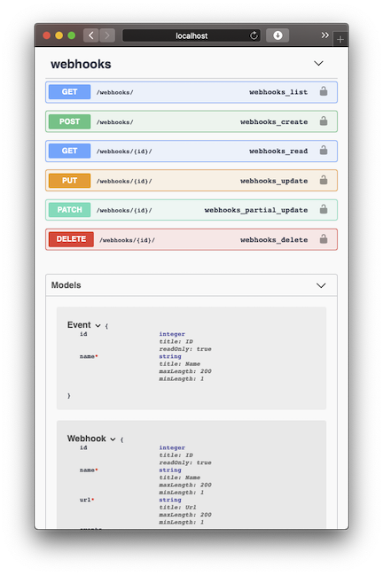
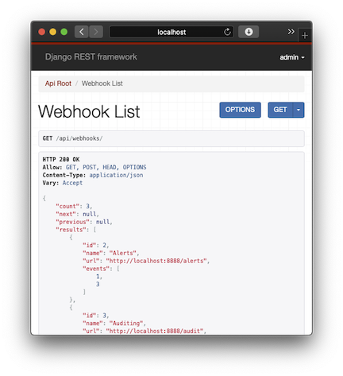

# API


Both webhooks (`api/webhooks`) and events (`api/events`) are available through RESTful API supporting CRUD operations
following standard conventions.

Implemented using the [Django REST framework](https://www.django-rest-framework.org).

Use the API console and help for the complete API documentation.

| `http://localhost:8000/api-help/` | `http://localhost:8000/api/` |
| --- | --- |
|  |   |


> NOTE: API endpoint URLs uses the default Django
>[trailing slash is required convention](https://docs.djangoproject.com/en/3.0/ref/settings/#append-slash).
>
>  `http://127.0.0.1:8000/api/webhooks/`: Correct usage
>
>  `http://127.0.0.1:8000/api/webhooks`: Will return `HTTP/1.1 301 Moved Permanently`


```shell script
$ curl  -s http://127.0.0.1:8000/api/webhooks/ | python -m json.tool
{
    "count": 3,
    "next": null,
    "previous": null,
    "results": [
        {
            "id": 2,
            "name": "Alerts",
            "url": "http://localhost:8888/alerts",
            "events": [
                1,
                3
            ]
        },
        {
            "id": 3,
            "name": "Auditing",
            "url": "http://localhost:8888/audit",
            "events": [
                3
            ]
        },
        {
            "id": 1,
            "name": "Logging",
            "url": "http://localhost:8888/logging",
            "events": [
                1,
                2,
                3,
                4
            ]
        }
    ]
}
```

```shell script
$ curl  -s http://127.0.0.1:8000/api/events/ | python -m json.tool
{
    "count": 5,
    "next": null,
    "previous": null,
    "results": [
        {
            "id": 1,
            "name": "create"
        },
        {
            "id": 3,
            "name": "delete"
        },
        {
            "id": 4,
            "name": "read"
        },
        {
            "id": 10,
            "name": "test"
        },
        {
            "id": 2,
            "name": "update"
        }
    ]
}
```


# API Approach

The API above uses the Django REST framework provided default handling using `rest_framework.viewsets.ModelViewSet`.

Instead we can also define custom handling, for example the webhook to events relations can also be handled using the
following alternate approach.

Remove `events` from the body for the existing `POST` `/webhooks/` then provide a new API for webhooks to events
relation.

| Method | Path | Notes |
| --- | ---- | ---- |
| GET | `/webhooks/<id>/events/` |  Get all events registered for the given webhook |
| PUT | `/webhooks/<id>/events/<id>` | Register the given event with the given webhook |
| DELETE | `/webhooks/<id>/events/<id>` | Unregister the given event from the given webhook  |

