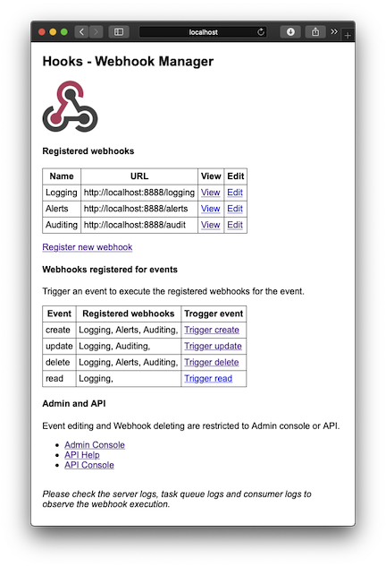

# Deploy with Docker


## Run the image from docker hub

On docker hub: [hackorama/hooks](https://hub.docker.com/r/hackorama/hooks)

```shell script
$ docker run -d --name=hooks -p 8000:8000 hackorama/hooks
```

> NOTE: Default Django admin credentials are `admin/admin` for hooks Docker image

## Or build a local image and run

```shell script
$ docker build -t hooks .

$ docker images | grep hooks
hooks                                  latest              1d1aefbd1bf1        11 hours ago        963MB

```


```shell script
$ docker run -d --name=hooks -p 8000:8000 hooks 

$ docker ps  | grep hooks
22aa8a5a45ca  hooks "/server/entrypoint.…"  8 minutes ago   Up 8 minutes   0.0.0.0:8000->8000/tcp   hooks
```

```shell script
$ docker logs hooks  --follow
...
Huey task queue worker started with logs at /server/hey.log
...
Starting Hooks Django server at http://localhost:8000/ ...
...
[2020-04-09 08:51:56,695] INFO:huey:Worker-1:Added task 2bb6a2bf-cb1a-4d04-aa8a-1cf0c1581f55 to schedule, eta 2020-04-09 15:51:59.694755
Added task 2bb6a2bf-cb1a-4d04-aa8a-1cf0c1581f55 to schedule, eta 2020-04-09 15:51:59.694755
...
Requesting POST http://localhost:8888/alerts {'event': 'create', 'time': '2020-04-09T08:51:48.381993'}
...

```

Test consumer is provided in the image and can be run as follows 

```shell script
$ docker exec -ti hooks bash
root@22aa8a5a45ca:/server# python /server/consumer.py
Starting webhook consumer at http://127.0.0.1:8888/
...
Received POST /audit event=create&time=2020-04-09T08%3A51%3A48.381993, Responded with 200
```

## Test

Open [http://127.0.0.1:8000](http://127.0.0.1:8000) on browser to access the server.

See [the tests page](tests.md) on how to use test consumer and test the webhook execution.




## TODO

- Split Django and Huey as separate images, and add an image for test consumer
  - Use Docker compose to deploy all images together 
  - Add a shared volume for same SQLite database for Django and Huey images
